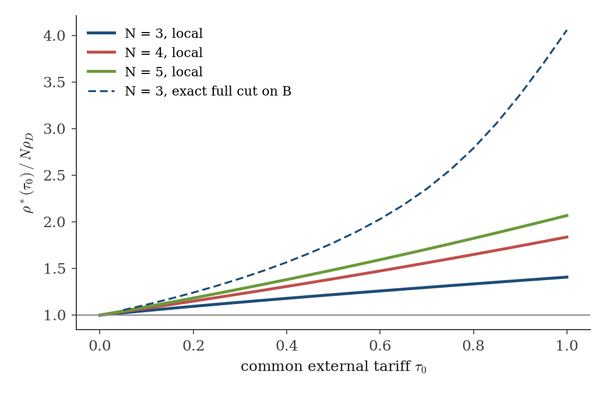
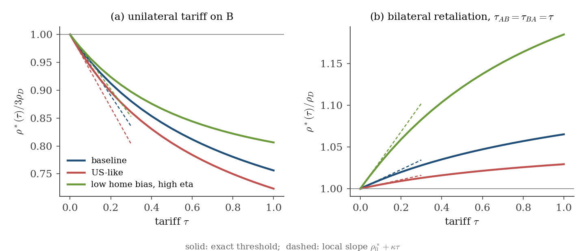
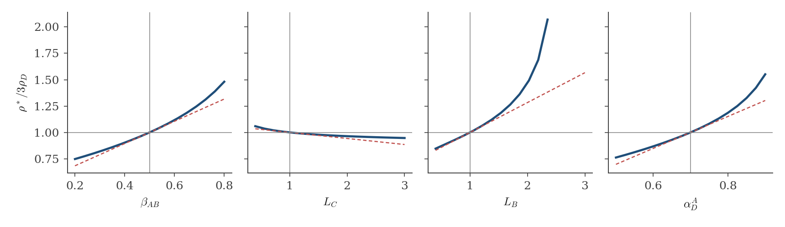
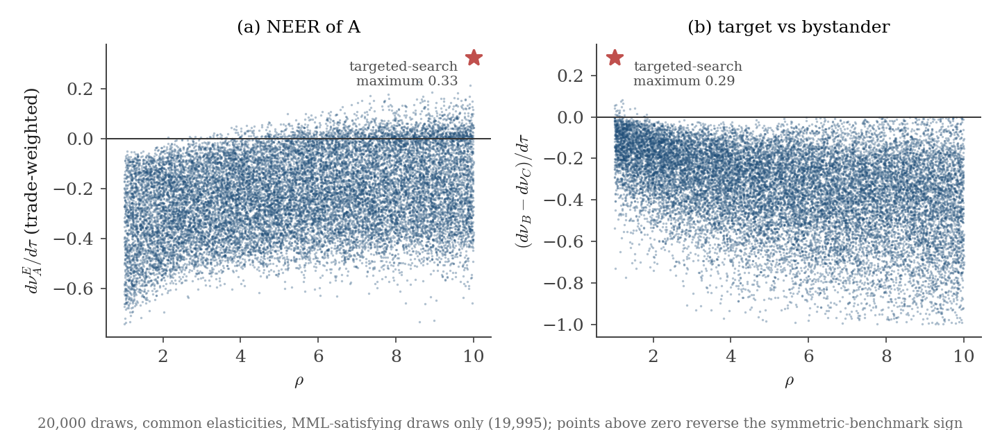

# Robustness results

*Understanding Multilateral Tariffs and Exchange Rates.* Computations of 22 September 2026. None of these results has been written into the paper.

Everything is reproducible from `robustness/`.

- Code: `model.py`, `verify.py`, `task_a.py` … `task_d.py`, `task_c_decomp.py`, `task_d_rho_scan.py`, `make_figures.py`, `style.py`.
- Numbers: `results/`. Figures: `figures/`.
- Run order: `python verify.py`, then each `task_*.py`. `python make_figures.py` redraws the B and D figures from the saved results.

Equation numbers refer to the current compiled `notes/model_derivations.pdf`. Sign convention as in the paper: $\nu_j=\log e_{Aj}$, and $d\nu_j>0$ is a depreciation of $A$ against $j$.

## 0. Setup and verification

Code: `robustness/model.py` (exact model, solver, complex-step and sympy linearizations), `robustness/verify.py`. Output: `results/verify.json`.

Model. Eqs. (17)–(20) exactly as in Section 3.1, with country-specific primitives $(L_i, A_{T_i}, A_{N_i}, \alpha_{T,i}, \alpha_{D,i}, \eta_i, \rho_i, \beta_{ij})$ and a general tariff matrix $\tau_{ij}$. $A$ is country 0 and the numeraire. $\nu_j=\log e_{Aj}$.

- Exact solver. Newton on $\mathrm{TB}_i=0$, $i\neq A$, with a complex-step Jacobian and backtracking. Residual $<10^{-15}$ of world income.
- Linearization, two routes.
  - sympy: $\widetilde J_{il}=\partial\mathrm{TB}_i/\partial\nu_l$, $G_{i,(jk)}=\partial\mathrm{TB}_i/\partial\tau_{jk}$ of the general symbolic model, then evaluated at any baseline.
  - complex step on the exact model. Exact to rounding. Used inside the searches.

| check | result |
|---|---|
| (25) two-country linearization | exact (symbolic) |
| (48) full Jacobian, $N=2,\dots,5$ | exact (symbolic) |
| (49) disturbance at unchanged rates, $N=3,4,5$ | exact |
| (50) $g_S,g_D$; (51) $-J=c(NI-\mathbf 1\mathbf 1')$; (52) $j_S,j_D$; $N=3,4,5$ | exact |
| (57) $N=3$ slopes of $e_{AB},e_{AC},e_{BC}$ | exact |
| exact $N=3$ responses $\to$ (57) as $\tau\to0$ ($\rho=1.5,3.51,5,8$) | error $O(\tau)$, $\approx4\times10^{-5}$ at $\tau=10^{-4}$ |
| (41), $N=2$, $\eta=1$, $L=(2,1)$, $A_T=(1.3,0.8)$, $\tau\le5$ | max error $6\times10^{-16}$ |
| sympy vs complex step, random asymmetric baseline with tariffs | max difference $7\times10^{-16}$ |
| (10) rows and columns of $\widetilde J$ sum to zero | $3\times10^{-16}$ |

No discrepancy with the paper.

Conventions used below.

- Tariff changes at a baseline with $\tau_0>0$ are $t_j=d\log(1+\tau_{Aj})$. This equals $d\tau_{Aj}$ at free trade, and a threshold is a sign condition, so it does not depend on the scaling.
- "MML" is checked as in (8): $J_{il}\ge0$ for $l\neq i$ and $(-J)^{-1}\ge0$ elementwise.

## A. Common external tariff

Code: `task_a.py`. Output: `results/task_a.json`, `figures/task_a_threshold.png`.

Baseline. $A$ levies $\tau_0$ on all $N-1$ partners. Partners are symmetric and levy nothing. The baseline is re-solved. $A$ appreciates against every partner by a common $\nu_0(\tau_0)$ ($-0.147$ at $\tau_0=0.5$, $-0.222$ at $\tau_0=1$, $N=3$). Partner symmetry holds, so Proposition 2.3 applies. MML holds at every baseline computed ($N=3,4,5$, $\tau_0\le1$, $\rho\in\{1.5,3.5,7\}$).

Baseline objects.
$$
\theta=\tfrac{\tau_0}{1+\tau_0},\quad
\mu_A=\text{import share of }A\text{'s tradable spending},\quad
\mu_P=\text{import share of a partner's tradable spending},
$$
$$
\omega=\text{share of }A\text{'s good in a partner's import bundle},\quad
\phi=\frac{\alpha_T\mu_A}{1-\theta\alpha_T\mu_A},
$$
$$
X=f_{Aj}=f_{jA},\qquad Y=f_{jk}\ (j,k\neq A),\qquad
x\equiv\frac{X}{X+(N-1)Y}=\frac{(N-2)\omega}{(N-2)\omega+(N-1)(1-\omega)}.
$$

Eigenvalues (derived by hand from the log-linear system, checked against the exact model to $2.5\times10^{-14}$).
$$
g_S=-X\,\rho_D(\tau_0),\qquad
\rho_D(\tau_0)=1-\phi(1-\theta)+(\eta-1)(1-\mu_A)(1+\phi\theta),
$$
$$
g_D=-X\rho,
$$
$$
j_S=X\,\mathcal M_S,\qquad
\mathcal M_S=1+(\eta-1)(1-\mu_A)(1+\phi\theta)+(\rho-1)(1-\omega)+(\eta-1)(1-\mu_P)\,\omega,
$$
$$
j_D=\big(X+(N-1)Y\big)\,\mathcal M_D,\qquad
\mathcal M_D=1+(\rho-1)\frac{N-3+\omega}{N-2}+(\eta-1)(1-\mu_P)\frac{N-1-\omega}{N-2}.
$$
$$
\lambda_A=\frac{g_S}{j_S}=-\frac{\rho_D(\tau_0)}{\mathcal M_S},\qquad
\lambda_R=\frac{g_D}{j_D}=-\frac{x\,\rho}{\mathcal M_D}.
$$

At $\tau_0=0$: $\theta=0$, $\phi=m$, $\mu_A=\mu_P=1-\alpha_D$, $\omega=1/(N-1)$, $x=1/N$. Then $\rho_D(0)=\rho_D$, $\mathcal M_S=\mathcal M_D=\mathcal M_N$, and Theorem 3.1 is recovered.

Bystander threshold. Tariff direction $\mathbf t=dt\,\mathbf e_B$ gives $d\nu_C=(\lambda_A-\lambda_R)\,dt/(N-1)$.
$$
d\nu_C>0\iff \rho\,x\,\mathcal M_S>\rho_D(\tau_0)\,\mathcal M_D
\iff \rho>\rho^\ast(\tau_0)=\frac{\rho_D(\tau_0)}{x}\,\frac{\mathcal M_D}{\mathcal M_S}.
$$
The right side still depends on $\rho$ through $\omega$, $\mu_P$, $x$ and $\mathcal M_S$, so $\rho^\ast$ is implicit. It is computed by root-finding with the baseline re-solved at each $\rho$.

- (i) A further tariff on $B$ and (ii) a preferential cut for $B$ ($\mathbf t=-dt\,\mathbf e_B$) have the same local threshold. The response is linear in $\mathbf t$, so (ii) flips the sign of $d\nu_C$ at the same $\rho^\ast$. In (ii), $C$'s terms of trade worsen iff $\rho>\rho^\ast(\tau_0)$.
- Exact check. A $\pm10^{-4}$ change in $\tau_{AB}$ in the exact model gives thresholds within $2\times10^{-4}$ of the local value at $\tau_0=0.25,0.5,1$.

Result.

| $\tau_0$ | $\rho^\ast/3\rho_D$, $N=3$ | $\rho^\ast/4\rho_D$, $N=4$ | $\rho^\ast/5\rho_D$, $N=5$ | exact full cut on $B$, $N=3$, $\div3\rho_D$ |
|---|---|---|---|---|
| 0.00 | 1.000 | 1.000 | 1.000 | – |
| 0.25 | 1.116 | 1.189 | 1.231 | 1.31 |
| 0.50 | 1.220 | 1.390 | 1.486 | 1.78 |
| 0.75 | 1.316 | 1.606 | 1.765 | 2.56 |
| 1.00 | 1.408 | 1.838 | 2.069 | 4.06 |

The last column is a finite preferential cut, $\tau_{AB}$ from $\tau_0$ to 0 in the exact model, with the threshold for $\log e_{AC}$ after the cut relative to before. In levels it is $\rho^\ast=4.61$, $6.23$ and $14.25$ at $\tau_0=0.25$, $0.5$ and $1$.

Where the rise comes from. Taking logs of the threshold condition, from $\tau_0=0$ to $\tau_0=1$ at $N=3$:
$$
\underbrace{\ln\frac{\rho^\ast(1)}{\rho^\ast(0)}}_{0.342}
=\underbrace{\ln\frac{\rho_D(1)}{\rho_D}}_{+0.122}
+\underbrace{\ln\frac{x(0)}{x(1)}}_{+0.660}
+\underbrace{\ln\frac{\mathcal M_D}{\mathcal M_S}\Big|_{\tau_0=1}}_{-0.440} .
$$

- $\rho_D(1)=1.322$ against $1.17$. The tariff base raises domestic diversion a little.
- $x$ falls from $1/3$ to $0.172$. After the common appreciation ($\nu_0=-0.222$) $A$'s goods are dearer, and $A$'s share in each partner's imports falls from $0.5$ to $\omega=0.294$. Relative treatment then hits a smaller part of each partner's trade, while $j_D$ scales with all of it. This is the main force.
- $\mathcal M_S$ rises relative to $\mathcal M_D$ ($4.29$ against $2.76$). The $(\rho-1)(1-\omega)$ term makes common adjustment stronger. This offsets two thirds of the fall in $x$.

Robustness and caveats.

- Local results at a symmetric-partner baseline in which partners levy no tariffs.
- The rise is steeper for larger $N$. The decomposition above was computed only for $N=3$.
- The finite full cut needs a far higher $\rho$ than the local threshold. The paper's free-trade threshold therefore understates what is needed for preferential liberalization to hurt the excluded country's terms of trade.
- MML holds throughout. The closed form is exact given the baseline shares, but the shares come from the numerical baseline.

## B. Finite unilateral tariff and bilateral retaliation ($N=3$, exact)

Code: `task_b.py`, `make_figures.py`. Output: `results/task_b.json`, `figures/task_b_threshold.png`.

Definitions.

- $\rho^\ast(\tau)$ solves $\log e_{AC}(\tau;\rho)=0$ in the exact model, starting from symmetric free trade.
- Unilateral: $\tau_{AB}=\tau$. First-order threshold $3\rho_D$.
- Retaliation: $\tau_{AB}=\tau_{BA}=\tau$. First-order threshold $\rho_D$.

Calibrations.

| name | $\alpha_D$ | $\alpha_T$ | $\eta$ | $\rho_D$ |
|---|---|---|---|---|
| baseline | 0.7 | 0.6 | 1.5 | 1.17 |
| US-like | 0.8 | 0.4 | 1.5 | 1.32 |
| low home bias, high $\eta$ | 0.5 | 0.6 | 3.0 | 1.70 |

The US-like row uses the paper's earlier US-realistic values. The third row stresses the home–import margin.

Local slope.
$$
\log e_{AC}(\tau)=a(\rho)\,\tau+\tfrac12 b_C\,\tau^2+O(\tau^3),
\qquad
\rho^\ast(\tau)=\rho^\ast_0+\kappa\,\tau+O(\tau^2),
\qquad
\kappa=-\frac{b_C}{2a'(\rho^\ast_0)} .
$$
$$
\text{unilateral: } a'=\frac{1}{6\mathcal M_3}\ \Rightarrow\ \kappa=-3\mathcal M_3 b_C,
\qquad
\text{retaliation: } a'=\frac{1}{2\mathcal M_3}\ \Rightarrow\ \kappa=-\mathcal M_3 b_C .
$$
$b_C=\partial^2\nu_C/\partial\tau^2$ is derived symbolically by second-order perturbation of the sympy model. It matches a finite-difference second derivative of the exact solver to 5 decimals.

Closed forms at the symmetric baseline, with $\mathcal M_3$ evaluated at $\rho^\ast_0$.
$$
\kappa_{\text{war}}=\frac{1-\alpha_D}{4}\Big[\alpha_D(\eta-1)^2+3\alpha_D\alpha_T(\eta-1)+2\alpha_T(1-m)\Big]\;>0,
$$
$$
\kappa_{\text{uni}}=-\frac{P_3(\alpha_D,\alpha_T,\eta)}{8\,\mathcal M_3}\;\le 0 .
$$
$P_3$ is a cubic, stored in `results/task_b.json`. It is nonnegative on $\alpha_D\in[1/3,1)$, $\alpha_T\in(0,1]$, $\eta\in[1,10]$, and zero only on the boundary.

| | $\rho^\ast_0$ | $\kappa$ | exact $(\rho^\ast(0.01)-\rho^\ast_0)/0.01$ | $\rho^\ast/\rho^\ast_0$ at $\tau=0.25$ | $0.5$ | $1$ |
|---|---|---|---|---|---|---|
| unilateral, baseline | 3.51 | $-1.93$ | $-1.90$ | 0.896 | 0.831 | 0.756 |
| unilateral, US-like | 3.96 | $-2.59$ | $-2.56$ | 0.878 | 0.805 | 0.723 |
| unilateral, low home bias | 5.10 | $-2.50$ | $-2.47$ | 0.910 | 0.859 | 0.806 |
| retaliation, baseline | 1.17 | $+0.134$ | $+0.133$ | 1.024 | 1.042 | 1.065 |
| retaliation, US-like | 1.32 | $+0.071$ | $+0.070$ | 1.011 | 1.019 | 1.029 |
| retaliation, low home bias | 1.70 | $+0.580$ | $+0.576$ | 1.071 | 1.122 | 1.185 |

The exact slope at $\tau=0.01$ differs from $\kappa$ by $O(\tau)$, as it should.

Result.

- Unilateral. A finite tariff lowers the reversal threshold. At $\tau=1$ it is 72–81% of $3\rho_D$. Baseline: $\rho^\ast(1)=2.65$ against $3\rho_D=3.51$.
- Mechanism. As $\tau_{AB}$ rises, $B$'s share of $A$'s imports falls. A further tariff on $B$ then adds less average protection, so the common appreciation weakens relative to diversion toward $C$. This is the $\beta_{AB}$ channel of Task C, which has the same sign.
- Retaliation. The threshold rises above $\rho_D$, but by little: 3–19% at $\tau=1$. $\kappa_{\text{war}}>0$ for all $\eta\ge1$.

Robustness and caveats. Both paths start at symmetric free trade, and the threshold is for the level $\log e_{AC}(\tau)$, not the marginal response at $\tau$. The unilateral sign ($\kappa\le0$) is established for the whole box above. The retaliation sign holds for all $\eta\ge1$ from the closed form. MML holds at every point computed. The paper's first-order thresholds therefore overstate the threshold for large unilateral tariffs. Under retaliation they understate it slightly.

## C. Asymmetry sensitivities ($N=3$, first order)

Code: `task_c.py`, `task_c_decomp.py`. Output: `results/task_c.json`, `results/task_c_decomp.json`, `figures/task_c_sensitivities.png`.

Setup.

- Start at the symmetric free-trade baseline with $\rho=3\rho_D$.
- Perturb one primitive $x$ and re-solve the free-trade equilibrium. Shares are never perturbed directly.
- $S(\rho;x)\equiv d\nu_C/d\tau_{AB}$ at the new baseline, and $\rho^\ast(x)$ solves $S=0$.

$$
\frac{d\rho^\ast}{dx}=-\frac{S_x}{S_\rho},\qquad S_\rho=\frac{1}{6\mathcal M_3},
$$
$$
S=\mathbf e_C'(-J)^{-1}F,\qquad
dS=\mathbf e_C'(-J)^{-1}\big[dF+dJ\,(-J)^{-1}F\big],\qquad
\frac{d\boldsymbol\nu_0}{dx}=-J^{-1}\mathrm{TB}_x .
$$
Here $dJ$ and $dF$ include the baseline shift $d\boldsymbol\nu_0/dx$. Everything is computed symbolically in sympy, giving closed forms in $(\alpha_D,\alpha_T,\eta)$ that are stored in `results/task_c.json`. They are confirmed by central finite differences of the exact $\rho^\ast(x)$ (Richardson), with agreement to $10^{-6}$.

Perturbations.

- $\beta_{AB}$: $A$'s weight on $B$, with $\beta_{AC}=1-\beta_{AB}$.
- $L_C$ and $L_B$: labour endowments.
- $\alpha_D^A$: home weight in $A$ only.

Attribution. From (9), $d\nu_C\propto\vartheta_{CB}F_B+\vartheta_{CC}F_C$, so at the threshold
$$
\underbrace{-F_C/F_B}_{R_F:\ \text{relative disturbance}}=\underbrace{\vartheta_{CB}/\vartheta_{CC}}_{R_\vartheta:\ \text{relative adjustment}},
\qquad
\frac{d\rho^\ast}{dx}=\underbrace{-\frac{\partial_x\ln R_F}{D_\rho}}_{\text{disturbance}}+\underbrace{\frac{\partial_x\ln R_\vartheta}{D_\rho}}_{\text{adjustment}},
\qquad D=\ln R_F-\ln R_\vartheta .
$$

| $x$ | $d\rho^\ast/dx$ (baseline) | $\div 3\rho_D$ | disturbance | adjustment | US-like | low home bias | sign on box |
|---|---|---|---|---|---|---|---|
| $\beta_{AB}$ | $+3.70$ | $+1.06$ | $+3.27$ | $+0.43$ | $+4.06$ | $+4.78$ | $>0$ everywhere |
| $L_C$ | $-0.20$ | $-0.06$ | $-1.12$ | $+0.92$ | $-0.32$ | $-0.09$ | $<0$ on 96% |
| $L_B$ | $+0.99$ | $+0.28$ | $+0.99$ | $0.00$ | $+1.23$ | $+1.10$ | $\ge0$ everywhere |
| $\alpha_D^A$ | $+5.31$ | $+1.51$ | $+2.88$ | $+2.43$ | $+6.61$ | $+7.58$ | $>0$ everywhere |

"Box" means $\alpha_D\in[1/3,1)$, $\alpha_T\in(0,1]$, $\eta\in[1,10]$, a $50^3$ grid. $L_C$ is positive only near $\alpha_T=1$ with $\eta$ close to 1. $L_B$ is zero only at the corner $\alpha_D=1/3$, $\alpha_T=1$.

Interpretation.

- $\beta_{AB}>0$. When $A$ buys more from $B$, a tariff on $B$ is a larger average-protection shock. $B$'s loss $F_B$ grows relative to $C$'s gain $F_C$, so a stronger $\rho$ is needed. The effect is almost all disturbance.
- $L_B>0$. At a free-trade baseline a larger $B$ must depreciate to balance its trade. $B$'s good becomes cheaper, and with $\rho>1$ $A$'s import share from $B$ rises. This is the $\beta_{AB}$ channel again, and it is pure disturbance ($\partial\ln R_\vartheta/\partial L_B=0$ to first order).
- $L_C<0$ and small. A larger $C$ depreciates, so $C$'s good is cheaper and $A$ buys more from $C$. This raises $R_F$ and lowers $\rho^\ast$ (disturbance $-1.12$). A larger $C$ also absorbs its own disturbance more easily, which lowers $\vartheta_{CC}$ relative to $\vartheta_{CB}$ (adjustment $+0.92$). The two nearly cancel.
- $\alpha_D^A>0$, the largest. More home bias in $A$ raises $A$'s domestic diversion relative to diversion toward $C$, which is the disturbance part. It also raises $\vartheta_{CB}/\vartheta_{CC}$, so $C$'s rate responds more to $B$'s loss per unit of its own gain, which is the adjustment part. The two parts are of similar size. For comparison, raising $\alpha_D$ in every country moves the symmetric threshold by $\partial(3\rho_D)/\partial\alpha_D=3(\eta-1+\alpha_T)=3.3$ at the baseline. Raising it in $A$ alone moves $\rho^\ast$ by more, $5.3$.

Solid: exact $\rho^\ast(x)/3\rho_D$ over a finite range. Dashed: first-order slope.

Robustness and caveats. These are first-order sensitivities at one point. The finite-range curves in the figure show strong convexity in $\beta_{AB}$, $L_B$ and $\alpha_D^A$. The $L_B$ curve ends near $L_B\approx2.35$. From there the reversal survives only inside a window of $\rho$ that closes again at high $\rho$. At $L_B=2.4$ that window is near $\rho=10$. At $L_B\ge2.6$ there is no reversal for any $\rho\le1000$, with MML holding. This is a qualitative break, not just a larger threshold (see D.2).

## D. NEER and ordering at asymmetric baselines ($N=3$)

Code: `task_d.py`, `task_d_rho_scan.py`, `make_figures.py`. Output: `results/task_d_draws.json`, `results/task_d_targeted_common.json`, `results/task_d_rho_scan.json`, `figures/task_d_search.png`.

Setup.

- Free-trade baseline, re-solved for every draw. First-order response to a unilateral tariff on $B$.
- MML checked explicitly as in (8), and only MML draws kept.
- $d\nu_A^E=w_{AB}\,d\nu_B+w_{AC}\,d\nu_C$, with baseline weights from (21).
- Two questions. (i) Can $d\nu_A^E>0$? (ii) Can $d\nu_B>d\nu_C$?

Search region ("common" variant).

| primitive | range |
|---|---|
| $L_i$ | log-uniform on $[1,10]$, so sizes span 1:10; $A_T=1$ |
| $\beta_{ij}$ | each country's weight on its first partner in $[0.1,0.9]$ |
| $\alpha_D$ | $[0.5,0.9]$, common to all countries |
| $\eta$ | $[1,4]$, common |
| $\rho$ | $[1,10]$, common |
| $\alpha_T$ | $0.6$ |

Search.

- 20,000 random draws. There were 0 solver failures. 19,995 satisfy MML, and the 5 failures violate the off-diagonal sign condition.
- Then differential evolution on each margin, seeded with the best draws.
- Each targeted optimum is confirmed by the exact model at $\tau_{AB}=0.01$.

Not run. The same search with $\alpha_D,\eta,\rho$ drawn separately for each country was stopped before it started so the memo could be written. It contains the common variant, so it cannot remove the counterexamples below; it can only make them larger.

Results.

| | random draws with sign reversed | largest in random draws | targeted maximum | exact check, $\tau=0.01$ |
|---|---|---|---|---|
| (i) $d\nu_A^E>0$ | 1,569 of 19,995 (7.8%) | $+0.228$ | $+0.327$ | $+0.00325$ |
| (ii) $d\nu_B>d\nu_C$ | 26 of 19,995 (0.13%) | $+0.082$ | $+0.287$ | $+0.00285$ |

Units: log change per unit tariff. For scale, the symmetric-benchmark NEER response at the baseline calibration is $-\rho_D/(2\mathcal M_3)=-0.21$.

Counterexamples exist for both questions. The first-order signs match the exact model at finite tariffs.

What the counterexamples share.

- (i) NEER depreciation.
  - Every case has $d\nu_C>0$, a bystander reversal.
  - $C$ carries most of $A$'s trade weight: $w_{AC}$ median 0.85, minimum 0.41.
  - $\rho$ is high: median 8.0, minimum 2.1.
  - The mechanism is a large bystander depreciation times a large weight. The equally weighted average $(d\nu_B+d\nu_C)/2$ is also positive in 14% of these cases.
  - Targeted maximum: $L=(1.3,1.3,3.6)$, $\beta_{AB}=0.9$, $\beta_{BA}=0.1$, $\beta_{CA}=0.9$, $\alpha_D=0.5$, $\eta=1$, $\rho=10$. All but $L$ sit on the box boundary.
- (ii) Ordering.
  - $\rho$ is near 1 (median 1.15) and $\eta$ is high (median 3.7).
  - $F_C<0$ in every case. With little cross-origin diversion, $C$ also loses from $A$'s tariff.
  - $C$ carries a small weight in $A$'s trade (median $w_{AC}=0.19$).
  - Targeted maximum: $L=(10,10,1)$, $\beta_{AB}=0.9$, $\beta_{CA}=0.1$, $\alpha_D=0.5$, $\eta=4$, $\rho=1$. This is a corner of the box. A small $C$ that sells little to $A$ appears to need a larger depreciation for a given loss than $B$ does; that reading is not attributed formally here.
- What holds in every draw. $d\nu_B<0$ in all 19,995, so $A$ always appreciates against the target. The 5 non-MML draws show neither reversal. Gross substitutability of $\widetilde J$ holds in 99.95% of the MML draws.

### D.2 Extra: the reversal can vanish at high $\rho$ when primitives are held fixed

Appendix B.3 (eq. 63) writes the $N=3$ numerator as a quadratic in $\rho$ with $c_2>0$. It concludes that "sufficiently strong substitution across import origins still reverses $e_{AC}$". The coefficients there are baseline shares and incomes, held fixed while $\rho$ varies.

With primitives held fixed, an asymmetric free-trade baseline has relative prices away from one, so the shares themselves move with $\rho$. As $\rho\to\infty$, each importer buys from its cheapest origin.

Scan: 500 draws from the box above, with $\rho$ on a 30-point grid in $[1,200]$ and MML holding at every point in 499 draws.

| pattern of $\operatorname{sign} d\nu_C$ as $\rho$ rises | draws |
|---|---|
| one change, positive at high $\rho$ (the appendix's picture) | 417 (84%) |
| positive window, negative again at high $\rho$ | 31 (6%) |
| never positive on $[1,200]$ | 50 (10%) |
| positive throughout, including $\rho\approx1$ | 1 |

Example from Task C: $L_B=2.2$, all else symmetric. $d\nu_C>0$ only for $\rho$ between about 6 and 50.

| $\rho$ | $A$'s import share from $B$ | $d\nu_C$, linear | exact at $\tau=0.01$, $\div\tau$ |
|---|---|---|---|
| 5 | 0.736 | $-0.018$ | $-0.016$ |
| 20 | 0.907 | $+0.026$ | $+0.028$ |
| 100 | 0.997 | $-0.009$ | $-0.008$ |
| 300 | 1.000 | $-0.004$ | $-0.004$ |

The large target has to depreciate to balance its trade, so its good is cheapest. At high $\rho$, $A$ stops buying from $C$ and there is nothing left to divert toward $C$. For $L_B\ge2.6$ there is no reversal at any $\rho\le1000$.

Robustness and caveats.

- Local results at a free-trade baseline, for $N=3$ only.
- The random draws only illustrate frequency; the shares above depend on the box and on uniform sampling.
- The two targeted maxima sit on the boundary of the box, so larger values exist outside it.
- The country-specific variant was not run.
- The NEER result uses the paper's own weights (21). Among the cases with trade-weighted depreciation, 14% also have a positive equally weighted average. The full frequency under equal weights was not counted.
- D.2 does not contradict eq. (63) as written, which is a statement at given shares. It does qualify the sentence that strong substitution "still reverses" $e_{AC}$ once the primitives are fixed.

## Summary

Survives.

- Setup. The linearization, (25), (48)–(52), (57) and (41) all check exactly.
- Proposition 2.3 at an equal-tariff baseline. The decomposition holds at a common external tariff $\tau_0$; symmetry is all it needs.
- $A$ appreciates against the target in every asymmetric draw (19,995 of 19,995).
- Unilateral first-order threshold $\rho>N\rho_D$ at free trade, and retaliation threshold $\rho>\rho_D$. Both are confirmed at small tariffs.
- Local equivalence of a further tariff on $B$ and a preferential cut for $B$. It holds at any $\tau_0$, because the response is linear.

Qualified.

- Theorem 3.1's coefficients hold only at free trade. At a common tariff $\tau_0$ they become $\lambda_A=-\rho_D(\tau_0)/\mathcal M_S$ and $\lambda_R=-x\rho/\mathcal M_D$ (Section A).
- The bystander threshold rises with $\tau_0$. At $N=3$, $\rho^\ast/3\rho_D=1.22$ at $\tau_0=0.5$ and $1.41$ at $\tau_0=1$. At $N=5$ and $\tau_0=1$ it is 2.07. This supports the paper's footnote on preferential liberalization and quantifies it.
- Finite unilateral tariffs lower the threshold, to 72–81% of $3\rho_D$ at $\tau=1$, with $\kappa\le0$ on the whole parameter box. Finite retaliation raises it slightly, by 3–19% at $\tau=1$.
- Asymmetry moves the threshold strongly. $d\rho^\ast/d\beta_{AB}\approx+3.7$, $d\rho^\ast/d\alpha_D^A\approx+5.3$, $d\rho^\ast/dL_B\approx+1.0$ and $d\rho^\ast/dL_C\approx-0.2$ at the baseline calibration.
- The trade-weighted NEER can depreciate under a unilateral tariff once partners are asymmetric. This happens in 7.8% of MML draws, with a maximum of $+0.33$ per unit tariff. It fits the appendix's statement that NEER appreciation "need not survive", now with examples.
- The ordering $d\nu_B<d\nu_C$ can fail (0.13% of draws, maximum 0.29), near $\rho=1$ with high $\eta$.

Surprising.

1. A full preferential cut for $B$ from $\tau_0$ has a much higher exact threshold than the local one: $4.61$ at $\tau_0=0.25$, $6.23$ at $0.5$ and $14.25$ at $1$, against $3.51$ at free trade.
2. With primitives fixed, strong cross-origin substitution does not guarantee a bystander reversal (D.2). In 16% of the draws scanned the response is negative at $\rho=200$. In 6% a window of reversal closes again, and in 10% no reversal appears at all. The cause is a large target's cheap good crowding $C$ out of $A$'s imports.
3. The effect of $L_B$ runs entirely through the disturbance ($\partial\ln R_\vartheta/\partial L_B=0$ to first order). The effect of $L_C$ is a near-cancellation of two larger opposing parts.
